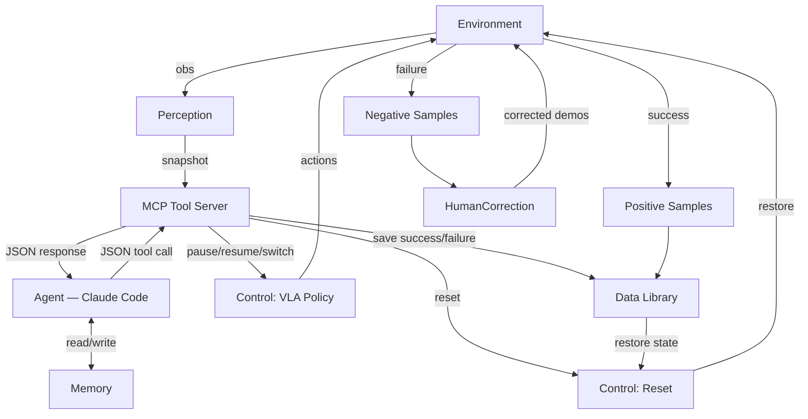

# B1K Agentic Data Collection System

> Instruction file for Claude Code. Read this before making changes to the embodiedClaw module.

## Definitions

| Term       | Meaning |
|------------|---------|
| **Task**   | A long-horizon mobile manipulation task (e.g., "clean the desk"). Each of the 50 benchmark tasks averages ~20 subtasks. |
| **Subtask**| An atomic robot action (e.g., "pick up book", "place book on bookshelf"). |
| **Agent**  | An AI agent (like Claude Code) — not a class or function in the codebase. |
| **VLA**    | Vision-Language-Action policy that executes subtasks. |
| **BDDL**   | Behavior Domain Definition Language — describes task goals and object states. |

## Available Datasets

**Data root:** `/home/user/dataset`
**Test task:** task index 1 = `picking_up_trash` (only this task downloaded so far)

| Directory | Contents | Format |
|-----------|----------|--------|
| `annotations/task-XXXX/` | Human-labeled subtask segments per episode | JSON (see schema below) |
| `data/task-XXXX/` | Robot state trajectories | Parquet |
| `raw/task-XXXX/` | Full simulation state recordings | HDF5 |
| `videos/task-XXXX/` | Camera recordings (head, left_wrist, right_wrist) | MP4 (**not yet downloaded**, download from https://huggingface.co/datasets/behavior-1k/2025-challenge-demos/tree/main/videos/task-0001) |

### Annotation file schema

Each `episode_XXXXXXXX.json` contains a `skill_annotation` array. Each entry:

```json
{
  "skill_idx": 0,                              // sequential subtask index
  "skill_description": ["move to"],            // human-readable action name
  "object_id": [["trash_can_116"]],            // target objects (NAME_NUMBER format)
  "manipulating_object_id": [],                // objects being grasped
  "frame_duration": [0, 325],                  // [start_frame, end_frame] in sim steps
  "skill_type": ["navigation"]                 // navigation | uncoordinated | coordinated
}
```

**Important:** Object names in annotations have a trailing number suffix (e.g., `trash_can_116`). To match with BDDL scope names (e.g., `ashcan.n.01_1`), strip the number and match by object type. **check the codebase, direct mapping could be found**

## Project Goal

Build an agentic system for 24/7 autonomous robotic data collection using the BEHAVIOR-1K benchmark. The system collects both successful and failed trajectory data, with human-in-the-loop correction for failures.

## Directory Layout

All code lives under:
```
OmniGibson/omnigibson/learning/embodiedClaw/
├── __init__.py                        # Re-exports all public tools
├── embodied_claw_sim_run.py           # AgenticEvaluator (patched from eval.py)
├── run_agentic.py                     # Production entry point (sim + MCP server)
├── mcp_server.py                      # MCP tool server — bridges agent ↔ sim
├── annotation_loader.py               # Parse annotation JSONs, compute duration stats
├── memory.py                          # TaskMemory — subtask progress tracking
├── decision_module.py                 # BDDL-based completion/failure detection
├── tools/
│   ├── __init__.py
│   ├── information_tools.py           # Snapshot capture & info filtering
│   ├── control_tools.py               # VLA pause/resume/reset/switch
│   ├── data_tools.py                  # CheckpointManager, success/failure saving
│   └── annotation_tools.py            # MCP wrappers for annotation/memory/decision
├── data_recording/
│   ├── data_saver.py                  # DataRecorder (video + parquet + metadata)
│   └── bddl_state_tracker.py          # BDDLStateTracker (goal condition monitoring)
└── skills/
    ├── SKILL.md                       # Active embodiedClaw skill entrypoint
    └── references/                    # Runtime-aligned skill references
```

> **Rule:** Do not modify files outside `embodiedClaw/`. The original `eval.py` must remain untouched.

---

## System Architecture

The system has five modules:

### 1. Decision Module
The brain. Decides which control skill to invoke based on perception and memory outputs.

### 2. Memory Module
Tracks task progress and prior experience (which actions worked, which failed).

### 3. Perception Module
Analyzes simulator state by fetching camera images, object states/poses, robot state, and task state (BDDL). Produces a structured snapshot for the decision module.

### 4. Control Skill Set
- **VLA Policy** — executes subtasks via a vision-language-action model.
- **Reset** — restores the simulator to the last saved checkpoint from the Data Library.

### 5. Data Library
Stores trajectory segments (not necessarily full episodes). Rules:

| Event | Action |
|-------|--------|
| Subtask **succeeds** | Save positive data up to checkpoint (crash protection), update checkpoint, continue to next subtask. |
| Subtask **fails** | Save segment from checkpoint to failure point as negative sample (parquet + video + HDF5 + meta). Revert sim to checkpoint. Increment retry counter, retry same subtask. |
| Same subtask fails **5 times** | Save start -> latest checkpoint as positive data (parquet + video + HDF5 + meta). All failure segments already saved individually. End episode. |
| **Episode complete** (all subtasks done) | Save entire trajectory (start -> end) as positive data (parquet + video + HDF5 + meta). |
| Failed trajectories | Available for batch human correction to produce failure-recovery data. |

### System Diagram



---

## Tools Specification

Each tool must be a callable function returning a JSON-serializable dict.

### Information Tools (`tools/information_tools.py`)

| Tool | Signature | Description |
|------|-----------|-------------|
| `get_simulation_snapshot` | `(env, robot, task_name, obs=None)` | Returns structured dict with images, robot state, object states, and BDDL state from a running simulation. |
| `filter_information` | `(snapshot, object_names: list[str])` | Filters a snapshot to only include objects in `object_names` and their associated poses, states, and BDDL predicates. |

**Verification:**
- `get_simulation_snapshot`: call on a running sim, confirm all expected fields are present.
- `filter_information`: pass a specific object name, confirm only that object's data is returned.

### Control Tools (`tools/control_tools.py`)

| Tool | Signature | Description |
|------|-----------|-------------|
| `pause_vla` | `(controller)` | Pauses the VLA policy via `threading.Event`. The sim loop blocks (does NOT zero-action). |
| `resume_vla` | `(controller)` | Resumes the VLA policy. |
| `reset_vla` | `(controller)` | Stub — resets VLA after simulator reset. |
| `switch_vla` | `(controller, ...)` | Stub — switches VLA model or language instruction for a new subtask. |

**Verification:**
- After `pause_vla`, capture images for 60s — they should be identical (sim is frozen).
- After `resume_vla`, images should change again.

### Data Tools (`tools/data_tools.py`)

| Tool | Signature | Description |
|------|-----------|-------------|
| `save_success_data` | `(checkpoint_mgr, env, robot, subtask_id, ...)` | Saves positive data up to checkpoint (crash protection), updates checkpoint. |
| `save_failure_data` | `(checkpoint_mgr, env, robot, subtask_id, ...)` | Extracts failure segment from main recorder, saves as negative sample, truncates recorder, restores last checkpoint. If same subtask fails 5 times, flags episode end. |
| `save_episode_data` | `(checkpoint_mgr, env, robot, success)` | Saves positive trajectory: entire trajectory on success, or start -> last checkpoint on failure. |

**Verification:**
- Call during a running simulation, confirm data files are written and checkpoint state is correct.

---

## MCP Tool Server (`mcp_server.py`)

An MCP server runs inside the simulator process, exposes every tool as a named MCP tool, and lets Claude Code (the agent) call them from a separate process. The server is a **thin routing layer**. Each `@mcp.tool()` handler delegates to the existing tool functions in `tools/`, binding live sim objects internally so only decision-relevant parameters are exposed to the agent.

`AgenticEvaluator` starts the MCP server after initializing the sim. Claude Code connects via `.claude/settings.json`.

### MCP Tool Definitions

| MCP Tool Name | Exposed Parameters | Maps To |
|---------------|-------------------|---------|
| `get_simulation_snapshot` | (none) | `information_tools.get_simulation_snapshot(env, robot, task_name)` |
| `filter_information` | `object_names: list[str]` | `information_tools.filter_information(snapshot, object_names)` — operates on the most recent snapshot |
| `pause_vla` | (none) | `control_tools.pause_vla(controller)` |
| `resume_vla` | (none) | `control_tools.resume_vla(controller)` |
| `reset_vla` | (none) | `control_tools.reset_vla(controller)` |
| `switch_vla` | `language_instruction: str`, `host?: str`, `port?: int` | `control_tools.switch_vla(controller, ...)` |
| `save_success_data` | `subtask_id: str`, `next_subtask_id?: str`, `next_language_instruction?: str` | `data_tools.save_success_data(checkpoint_mgr, env, robot, ...)` -- saves positive data up to checkpoint, updates checkpoint |
| `save_failure_data` | `subtask_id: str` | `data_tools.save_failure_data(checkpoint_mgr, env, robot, ...)` -- saves failure segment, truncates, reverts |
| `save_episode_data` | `success: bool` | `data_tools.save_episode_data(checkpoint_mgr, env, robot, success)` -- saves positive trajectory |
| `load_task_annotations` | `task_id: int` | `annotation_tools.load_task_annotations(...)` -- loads annotations and duration stats |
| `get_task_memory` | (none) | `annotation_tools.get_task_memory_summary(...)` -- returns current subtask index, subtask_start_step, retry counts, failure threshold |
| `advance_to_next_subtask` | (none) | `annotation_tools.advance_subtask(...)` -- marks current subtask succeeded, advances to next |
| `record_failure` | (none) | `annotation_tools.record_subtask_failure(...)` -- marks current subtask failed, returns retry count |
| `get_subtask_language_instruction` | `skill_idx?: int` | `annotation_tools.get_language_instruction(...)` -- returns VLA language instruction for subtask |
| `get_demo_reference_frames` | `skill_idx: int`, `camera?: str`, `max_episodes?: int` | `demo_tools.get_demo_reference_frames(...)` -- returns base64 demo frames for visual comparison |

### Verification

1. **Connection test:** Start the sim with the MCP server. From a separate Claude Code session, confirm the tools appear in Claude Code's tool list.
2. **Round-trip control:** Call `pause_vla` → confirm sim loop halts. Call `resume_vla` → confirm sim resumes.
3. **Snapshot retrieval:** Call `get_simulation_snapshot` → confirm returned JSON contains `images`, `robot_state`, `object_states`, `world_predicates`, `step_count`, `task_name`.
4. **Data save:** Call `save_success_data` with a `subtask_id` → confirm data files are written and checkpoint is updated.
5. **Full agent loop:** Execute `pause_vla` → `get_simulation_snapshot` → `filter_information` → `save_success_data` or `save_failure_data` → `resume_vla`. Confirm the agent completes this cycle without accessing sim Python objects directly.

---

## Implementation Stages

### Stage 1: Foundation (COMPLETED)

Code structure and tool implementations are in place. See directory layout above.

**Key design decisions made:**
- Pause halts sim loop via `threading.Event.wait()` (blocking, not zero-action)
- All tool functions return JSON-serializable dicts
- Video encoding uses PyAV (H.264/H.265), tabular data uses Parquet, metadata uses JSON
- `BDDLStateTracker` monitors goal conditions and records every transition with step index
- Original `eval.py` is untouched; `embodied_claw_sim_run.py` is the new entry point
- MCP (Model Context Protocol) chosen as the agent ↔ sim bridge — Claude Code has native MCP client support

### Stage 2: MCP Server & Integration Testing (COMPLETED)

1. Implement `mcp_server.py` — wrap all tool functions as MCP tools, bind live sim objects, expose only agent-facing parameters.
2. Integrate MCP server startup into `AgenticEvaluator` so the server launches alongside the sim.
3. Configure Claude Code to connect to the MCP server (add entry to `.claude/settings.json`).
4. Bring up the simulator and verify each MCP tool end-to-end from a separate Claude Code session.
5. Run the full MCP verification suite (see MCP Tool Server § Verification above).
6. Iterate on failures — fix issues discovered during integration testing.

### Stage 3: Decision Module (COMPLETED)

> **Implementation form:** embodiedClaw skill bundle. The active entrypoint lives at `embodiedClaw/skills/SKILL.md`. When invoked, the agent uses the MCP tools to run the full decision loop autonomously.

The decision module orchestrates the full data collection loop: **Observe (async) → Decide → Act (pause only here) → Record**.

#### 3.1 Observe (Async — do NOT pause on every check)

> **Critical:** The VLA policy runs continuously. The agent monitors progress **asynchronously** without pausing. Only call `pause_vla` when making a critical decision (save success/failure, switch subtask). Normal observation reads the latest snapshot without stopping the sim.

1. Call `get_simulation_snapshot` to get images, robot state, object states, and world predicates. This works **without pausing** because it reads from the latest available state.
2. Load the annotation file for the current task/episode from `/home/user/dataset/annotations/task-XXXX/`.
3. Read `skill_annotation` to get the ordered subtask list. Start with subtask 0.
4. Call `filter_information` with the object names from the current subtask's `object_id` field.
   - **Name mapping:** Annotation names use `NAME_NUMBER` format (e.g., `trash_can_116`). Strip the number suffix to match BDDL scope names by object type.
   - The agent decides which objects are relevant — the annotation provides the default set.
5. Only call `pause_vla` when the agent decides to **act** (save data, switch subtask, or reset).

#### 3.2 Memory

Track current task progress semantically:
- Which subtask index we're on.
- How many steps have elapsed for the current subtask.
- Retry count for the current subtask.
- Prior observations and decisions.

#### 3.3 Decision

The agent chooses one of three actions:

| Action | When to trigger | What happens |
|--------|----------------|--------------|
| **Continue** | Subtask still in progress | Do nothing — VLA is already running. Check again after N steps. |
| **Success → next subtask** | Subtask completed | `pause_vla` → `save_success_data` with `next_language_instruction` → `resume_vla` |
| **Failure → reset** | Subtask failed | `pause_vla` → `save_failure_data` → `resume_vla` (retries from checkpoint) |

**How to judge subtask completion (two approaches — keep both):**

- **Approach 1 (BDDL-based):** Check if the BDDL predicates relevant to the current subtask changed to their target values. Combine with the agent's visual understanding of the scene.
- **Approach 2 (demo-comparison):** Extract reference frames from demo data (completion frames + intermediate frames) and compare with current observation. Helps avoid premature switching when visual differences are subtle. May need a new MCP tool or a pre-extracted demo frame library.

**How to judge subtask failure:**

- Only trigger failure if elapsed steps > **2x the max subtask duration** from the annotation's `frame_duration` across all demo episodes for that subtask.
- Optionally compare with demo frames to confirm the robot is stuck or diverged.

#### 3.4 VLA Policy Server

The VLA runs as a separate process on GPU 1. It accepts WebSocket connections from the simulator and returns actions continuously.

```bash
cd /home/user/codebase/behavior-1k-solution
source .venv/bin/activate
CUDA_VISIBLE_DEVICES=1 uv run scripts/serve_b1k.py policy:checkpoint \
    --policy.config pi_behavior_b1k_fast \
    --policy.dir /home/user/codebase/behavior_submission/checkpoint_2
```

The simulator connects to this server via `policy=websocket model.host=localhost model.port=8000`.

#### 3.5 Record

When the decision is **success** or **failure**, the data tools handle saving automatically (parquet, video, metadata, BDDL transitions). The agent just calls the appropriate MCP tool.

#### 3.6 Verification

Three-step validation. **All tests must use the live simulator.**

1. **Decision skill test:** On a test instance with the VLA server running, verify the decision skill correctly calls the observe → decide → act cycle.

2. **Ground truth replay — decision accuracy test:**

   Replay HDF5 episodes frame-by-frame through the simulator (no VLA). A separate test agent connects via MCP, observes at regular intervals using `get_simulation_snapshot` + `get_demo_reference_frames`, and uses its own reasoning (snapshot images vs. demo completion frames + BDDL state) to decide when each subtask completes.

   **Metric:** `frame_error = agent_decision_frame - gt_end_frame`. Measure accuracy at ±50, ±100, ±200, ±500 frame thresholds. Save per-subtask results (skill_idx, gt_end_frame, agent_decision_frame, frame_error, within_X booleans) and per-episode summary (accuracy at each threshold, mean/median error). Target: ≥80% at ±100 frames.

3. **Live collection test:** On a new test instance, run the full agent loop. Record: (a) what decisions were made, (b) at which simulation step each decision occurred, (c) whether data files were written correctly. Flag uncertain results for human validation.

> **Do not skip verification steps or take shortcuts. Record any questions that need human clarification.**

### Stage 4: 24/7 Supervisor (TODO)

Python supervisor + disposable agent workers. The supervisor handles process lifecycle (start/stop/restart VLA, sim, agent). The agent (currently Claude Code, eventually direct API calls) handles decision-making per episode.

**TODO:** Switch from Claude Code to direct Anthropic API calls with company API key. This gives better control over token usage, timeouts, error handling, and agent liveness detection.

**Liveness:** The supervisor must detect whether each worker agent is alive or dead. When a worker crashes unexpectedly (not normal termination) while the sim is paused, the supervisor cleans up (resume sim, restart worker). The sim should NOT auto-resume on its own; only the supervisor decides.

**State persistence:** Single progress JSON file tracking which episodes are done. In-progress episodes are re-run from scratch on restart.

**Data verification:** Supervisor verifies output files (HDF5, parquet, video exist and non-empty) before marking episode done.

---

## Coding Conventions

- All new code goes in `embodiedClaw/` — do not modify existing OmniGibson files.
- Tool functions must return JSON-serializable dicts (no raw numpy arrays, no OmniGibson objects).
- Use type hints on all public function signatures.
- Keep files focused: one concern per module (information, control, data).
- Prefer explicit over implicit — no hidden side effects in tool calls.
